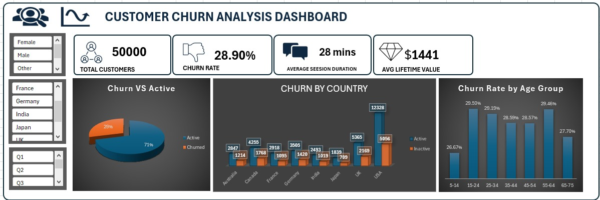

# Data Analysis Portfolio

**PROJECT 1**
# 📊 [Customer Churn Analysis Dashboard](https://github.com/justvictorav/justvictorav.github.io/blob/main/ecommerce%20customer%20churn%20dashboard.xlsx)

## 🔍 Project Overview
Customer churn is a major challenge for businesses, as losing customers directly impacts revenue and growth.  
This project analyses customer data to identify churn patterns, understand customer behaviour, and highlight key risk factors.

---

## 🛠️ Tools Used
- Microsoft Excel  
- Pivot Tables  
- Slicers  
- Data Cleaning & Transformation  

---

## 📈 Key Metrics
- Total Customers: 50,000  
- Churn Rate: 28.9%  
- Average Session Duration: 28 Mins 
- Average Lifetime Value: $1441  

---

## 💡 Key Insights
- The churn rate is relatively high (~29%), indicating a potential retention issue.  
- Churn is consistent across countries, suggesting the problem is systemic rather than location-specific.  
- Younger customers show slightly higher churn rates compared to older groups.  
- With an average lifetime value of $1441 per customer, churn represents a significant revenue loss.  

---

## 📊 Dashboard Features
- Interactive filters (Gender, Country, Signup Quarter)  
- KPI overview for quick performance tracking  
- Visual breakdown of churn distribution  
- Regional and demographic churn analysis  

---

## 📁 Dataset
The dataset used represents e-commerce customer behaviour, including demographics, engagement, and churn indicators.

---

## 🖼️ Dashboard Preview

---

## 🚀 Conclusion
This dashboard provides a clear overview of customer churn patterns and highlights areas where businesses can focus their retention strategies to improve long-term profitability.
